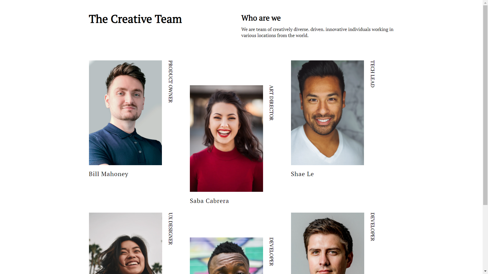

<!-- Please update value in the {}  -->

<h1 align="center">Team Page</h1>

   Solution for a challenge from  <a href="http://devchallenges.io" target="_blank">Devchallenges.io</a>.

  <h3>
    <a href="https://team-page-swart.vercel.app/">
      Demo
    </a>
     | 
    <a href="https://github.com/AmanDeep9925/team-page">
      Solution
    </a>
     | 
    <a href="https://devchallenges.io/challenges/hhmesazsqgKXrTkYkt0U">
      Challenge
    </a>
  </h3>

<!-- TABLE OF CONTENTS -->

## Table of Contents

-   [Overview](#overview)
    -   [Built With](#built-with)
-   [Features](#features)
-   [Contact](#contact)
-   [Acknowledgements](#acknowledgements)

<!-- OVERVIEW -->

## Overview

Introduce your projects by taking a screenshot or a gif. Try to tell visitors a story about your project by answering:

-   [Demo](https://team-page-swart.vercel.app/)
-   Loved coding this up
-   Learned alot with this
-   Just keep doing 😎

### Built With

<!-- This section should list any major frameworks that you built your project using. Here are a few examples.-->

-   HTML
-   CSS

## Contact

-   GitHub [@AmanDeep9925](https://github.com/AmanDeep9925)
